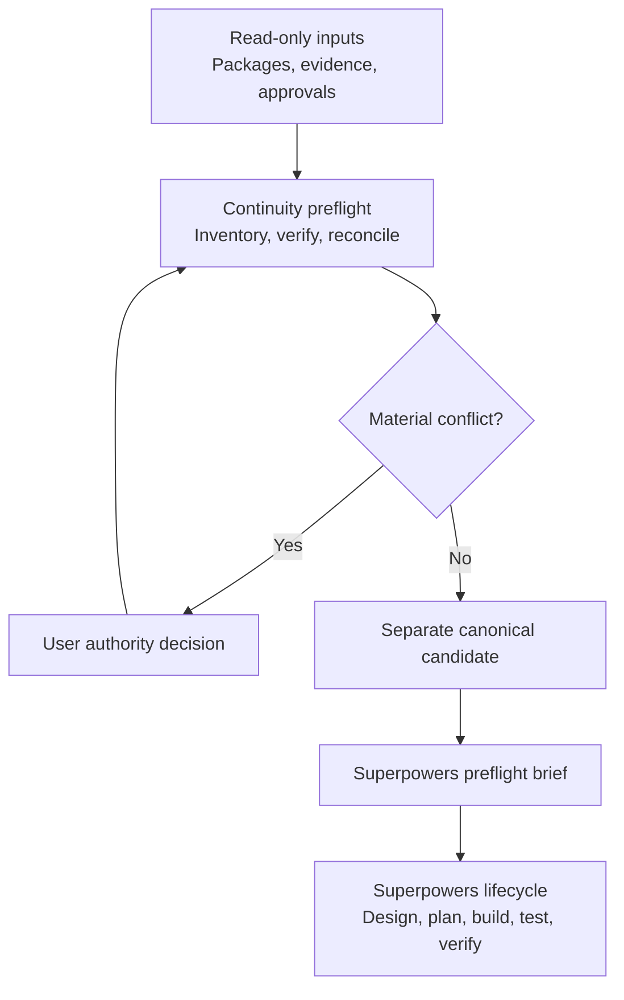
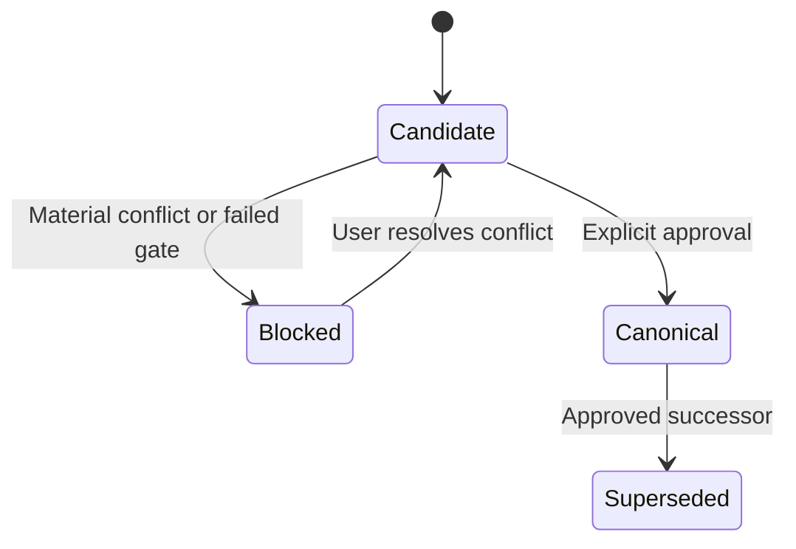

# Continuity Plugin Design

**Date:** 2026-08-09

**Status:** Approved design; implementation not started

**Primary audience:** Solo builders managing complex projects across multiple ChatGPT or Codex sessions
**Companion plugin:** Superpowers

## 1. Purpose

Continuity is a Project Intelligence plugin that prevents context drift and conflicting handoffs. It establishes a trustworthy, portable project state before another workflow plans or executes work.

Continuity and Superpowers have separate responsibilities:

- Continuity recovers and validates project truth.
- Superpowers brainstorms, plans, implements, tests, reviews, and verifies work from that approved truth.

Continuity works independently, but produces a specialized preflight brief when Superpowers is installed. This follows the current OpenAI plugin model: focused skills provide repeatable workflows, while MCP is added only when a use case needs live data, authentication, controlled actions, or operated code. See the [OpenAI Plugins overview](https://developers.openai.com/plugins).

## 2. User outcome

Given one or more handoff packages, repository snapshots, reports, receipts, or user decisions, Continuity must:

1. Treat every supplied source as read-only evidence.
2. Inventory and identify every artifact.
3. Verify hashes, manifests, lineage, dates, approvals, and completeness.
4. Detect conflicting project states and classify each conflict.
5. Preserve uncontested facts without inventing missing evidence.
6. Require user resolution for every material authority conflict.
7. Generate a separate portable canonical candidate.
8. Promote that candidate only after explicit user approval.
9. Produce an exact readiness decision and next-action brief for Superpowers.

## 3. Scope

### In scope for version 1

- Uploaded ZIP handoffs and their checksum sidecars.
- Unpacked project folders and repository snapshots available in the active workspace.
- Markdown, text, JSON, YAML, TOML, and other safely readable project records.
- File inventory, SHA-256 verification, manifest comparison, and lineage analysis.
- Requirements, decisions, approvals, blocked actions, unresolved facts, and evidence indexing.
- Candidate handoff construction and integrity validation.
- Superpowers preflight generation.
- Deterministic scripts using packaged resources and the local execution environment.

### Out of scope for version 1

- Cloud synchronization or persistent remote project databases.
- OAuth, user accounts, or external identity providers.
- Automatic publication, deployment, repository pushes, or third-party mutations.
- Silent conflict resolution based only on timestamps.
- Replacing Superpowers' brainstorming, planning, implementation, debugging, or review workflows.
- A custom dashboard or other required UI.

## 4. Architecture

Continuity is a preservation-first preflight gate. Original packages remain immutable. Generated output is a new package with its own identity and checksum.

## 5. Before-and-after experience

| Without Continuity | With Continuity and Superpowers |
| --- | --- |
| A later chat may assume the newest package is authoritative. | Continuity compares lineage, integrity, completeness, and authority first. |
| Conflicting claims may be merged implicitly. | Material conflicts remain blocked until the user resolves them. |
| Approvals and prohibited actions may be scattered across conversations. | The authority ledger records allowed, blocked, and undecided actions explicitly. |
| Unknown facts may be summarized as if verified. | Verified, asserted, unresolved, contradicted, and missing evidence remain distinct. |
| Superpowers may receive an incomplete or drifted brief. | Superpowers receives a readiness status, canonical scope, and exact authorized next action. |

## 6. Skill components

### `project-intelligence`

The entry skill. It identifies the selected project, gathers supplied inputs, records assumptions, and routes to inspection, reconciliation, package construction, or Superpowers preflight.

### `inspect-project-state`

Inventories source packages and project files. It extracts project identity, goals, requirements, decisions, approvals, current progress, evidence, unresolved facts, and safety gates without changing any source.

### `reconcile-project-state`

Builds the lineage model, verifies integrity, compares competing states, distinguishes material from non-material differences, and produces a conflict report. It may preserve uncontested facts but may not decide material authority conflicts.

### `create-canonical-handoff`

Generates a separate candidate package from approved reconciliation results. It validates the completed package, generates its checksum, and promotes it from `Candidate` to `Canonical` only after explicit user approval.

### `superpowers-preflight`

Produces `SUPERPOWERS_PREFLIGHT.md` containing readiness, canonical scope, authorized actions, prohibited actions, unresolved facts, exact next action, and the relevant Superpowers skill or stage. It does not invoke implementation while Continuity reports `Blocked`.

## 7. Deterministic support scripts

Packaged scripts must provide:

- safe archive inspection and extraction;
- SHA-256 generation and verification;
- normalized file inventory;
- manifest creation and comparison;
- duplicate, missing, and unexpected-file detection;
- package-contract validation;
- lineage graph generation; and
- candidate ZIP construction without editing source packages.

Script results must be structured and model-readable. Ordering must be stable. Paths must be normalized without discarding the original observed path. Time-dependent metadata must be isolated so normalized findings remain equivalent for identical inputs.

## 8. Portable package contract

The version 1 schema identifier is `continuity.package/v1`.

| Path | Required purpose |
| --- | --- |
| `HANDOFF_README.md` | Entry point, schema, package identity, status, creation time, and safe resume instructions |
| `CANONICAL_STATE.md` | Confirmed goal, requirements, architecture, progress, and project health |
| `AUTHORITY_LEDGER.md` | Decisions, approvals, prohibited actions, and approval boundaries |
| `CONFLICT_RESOLUTIONS.md` | Conflicts, compared evidence, user resolutions, and rejected alternatives |
| `UNRESOLVED.md` | Missing evidence, unanswered questions, blockers, and facts requiring confirmation |
| `NEXT_THREAD_PROMPT.txt` | Exact prompt for resuming in a fresh ChatGPT or Codex session |
| `SUPERPOWERS_PREFLIGHT.md` | Readiness, authorized scope, exact next action, and recommended Superpowers stage |
| `lineage/LINEAGE.json` | Parent packages, source hashes, timestamps, and authority relationships |
| `evidence/INDEX.json` | Evidence identity, provenance, validation state, and included or external references |
| `canonical/` | Selected project files required for safe continuation |
| `receipts/` | Validation, comparison, test, and approval evidence |
| `MANIFEST.json` | Machine-readable inventory of payload files, schema, status, package ID, and root relationships; its `files` array excludes `MANIFEST.json` and `SHA256SUMS.txt` |
| `SHA256SUMS.txt` | Actual byte-level SHA-256 for every packaged file except the checksum file itself, including `MANIFEST.json` |

Historical source packages do not need to be duplicated inside every successor. They may be referenced by immutable SHA-256 and package identity when their bytes remain available. Evidence required to continue safely must be embedded in `canonical/` or `receipts/`.

Candidate and canonical outputs are published as one outer release directory. The release directory contains `package/` with the unpacked portable package and `<package_id>.zip` with the deterministic archive of that package. The outer directory crosses one atomic rename boundary, so the unpacked package and ZIP cannot be published separately. The outer release container is transport structure and is not included in the package manifest or checksum inventory.

## 9. Package lifecycle

- `Candidate` means generated but not authoritative.
- `Blocked` means the candidate cannot be promoted or handed to execution.
- `Canonical` means explicitly approved as the current authoritative root.
- `Superseded` remains valid historical evidence but is not the current root.

Promotion is append-only: it creates a promotion receipt and changes the new package's authority state. It never deletes or rewrites a predecessor.

## 10. Authority and reconciliation rules

Continuity must evaluate authority using all available evidence rather than a single timestamp. Relevant signals include:

1. Verified package and file integrity.
2. Explicit lineage and declared parent relationships.
3. Confirmed user approvals and their exact scope.
4. Completeness of required project state and evidence.
5. Consistency with previously approved architecture and safety gates.
6. Creation and modification times as supporting, not controlling, evidence.

An approval for one action does not imply approval for another. Broad urgency, administrative access, or a newer timestamp cannot override a narrower documented restriction.

Continuity may automatically merge only uncontested facts whose provenance is preserved. It must ask the user to resolve a conflict when competing choices would change architecture, behavior, scope, authority, safety, release readiness, or the exact next action.

## 11. Evidence states

Every material claim must use one of these states:

- `Verified`: directly supported by inspected evidence whose relevant integrity checks pass.
- `Asserted`: stated by the user or a source but not independently verified.
- `Unresolved`: insufficient evidence to decide.
- `Contradicted`: credible inspected sources disagree.
- `Missing`: a required artifact or field is confirmed absent from the inspected scope.

`Not found` and `does not exist` are not interchangeable. A limited search may justify `Unresolved`, not `Missing`.

## 12. Readiness rules

### `Ready`

Integrity passes, canonical authority is clear, no material conflict remains, and the exact next action is within the recorded authorization boundary.

### `Conditional`

Remaining unknowns are documented and demonstrably do not affect the proposed next action. Every condition must be stated in the preflight brief.

### `Blocked`

Integrity failed, authority conflicts remain, required evidence is missing, the requested action exceeds approval, or the selected project cannot be identified reliably.

## 13. Error handling

- Reject unsafe archive entries, including path traversal, absolute paths, duplicate destinations, symlink escapes, and unsafe expansion ratios.
- Preserve both expected and observed hashes on mismatch and report `Blocked`.
- Mark missing checksums `Unresolved`; never claim verification.
- Require a user decision for conflicting approvals.
- Inventory unsupported or unreadable files without inventing their contents.
- Detect likely secrets, redact them from reports, and exclude them from generated packages unless the user explicitly supplies an approved secure handling requirement.
- Use one atomically renamed outer release directory for candidate and canonical publication so interruptions cannot expose only the unpacked package or only its ZIP.
- Keep originals untouched even when candidate creation or validation fails.

## 14. Capability decisions

| Capability | Version 1 classification | Justification |
| --- | --- | --- |
| Skills | Required | They define the project-intelligence workflows. |
| Packaged scripts | Required | Integrity and manifest operations must be deterministic. |
| MCP | Not currently needed | Version 1 works on files available in the active workspace. |
| OAuth | Not needed | No external account access exists in version 1. |
| Custom UI | Optional future improvement | A lineage and conflict viewer could help large reconciliations, but every workflow must remain complete without UI. |
| Superpowers | Recommended companion | Continuity remains independently useful and does not hard-depend on Superpowers. |

## 15. Validation plan

### Static and schema validation

- Validate every required plugin path after packaging.
- Validate `MANIFEST.json`, `LINEAGE.json`, and `evidence/INDEX.json` against versioned schemas.
- Verify that all required Markdown and text artifacts exist and are non-empty.

### Unit tests

- Hash generation and mismatch detection.
- Stable inventory ordering and path normalization.
- Manifest creation and comparison.
- Duplicate, missing, unexpected, and unsupported-file classification.
- Readiness status calculation.
- Candidate lifecycle and promotion gate enforcement.

### Security and reliability tests

- ZIP path traversal, absolute paths, duplicate paths, symlink escapes, and archive bombs.
- Corrupt and truncated archives.
- Interrupted candidate creation.
- Secret redaction.
- Repeated identical inputs and normalized-output equivalence.

### Behavioral fixtures

- Older complete handoff versus newer incomplete handoff.
- Newer package with a broken checksum.
- Matching content with different filenames.
- Conflicting architecture approvals.
- Broad chat authorization conflicting with a narrower recorded safety gate.
- Missing evidence that must remain `Unresolved`.
- Invented-evidence pressure and unsupported conclusions.
- Multiple independent projects accidentally packaged together.
- Canonical predecessor plus legitimate approved successor.
- Superseded handoff incorrectly presented as current.

### Integration and companion validation

- Run uploaded packages through inspection, reconciliation, candidate creation, validation, and promotion.
- Confirm that originals are byte-identical before and after processing.
- Confirm that a `Blocked` preflight cannot transition into Superpowers implementation.
- Confirm that `Ready` preflight includes sufficient scope, authority, evidence, and next-action context for Superpowers without modifying Superpowers' workflow.

## 16. Release-blocking invariants

1. Original evidence is never overwritten.
2. Material conflicts are never silently resolved.
3. Unverified claims are never presented as verified facts.
4. A candidate is never labeled canonical without explicit approval.
5. Superpowers never receives `Ready` while a required integrity or authority gate is unresolved.
6. A superseded package is never described as the current canonical root.
7. Every included canonical file is covered by the package manifest and checksum inventory.

## 17. Acceptance criteria

Version 1 is acceptable only when:

- all five skills activate for their intended workflows and avoid unrelated requests;
- all required package artifacts and references resolve after plugin installation;
- deterministic scripts pass unit, security, and fixture tests;
- candidate and canonical lifecycle gates cannot be bypassed in behavioral tests;
- identical source inputs produce equivalent normalized findings;
- source packages remain byte-identical after every successful and failed run;
- the full behavioral fixture set contains no invented-evidence or false-authority acceptance;
- a complete end-to-end fixture produces a valid candidate ZIP and checksum; and
- an approved `Ready` package can hand off to Superpowers with no missing material context.

## 18. Future improvements

After version 1 is validated, optional improvements may include:

- an MCP-backed project registry for persistent storage and retrieval;
- OAuth for owner-specific cloud workspaces;
- a visual lineage and conflict viewer;
- cloud synchronization using the portable package contract as the authority interchange format; and
- collaboration support for teams with multiple approvers.

Each improvement requires a demonstrated project requirement and a separate approved design. No future capability may create a second silent source of truth.

## 19. Final design decision

Continuity version 1 is a skills-first, preservation-first, portable preflight plugin for solo builders. It reconciles project truth, creates reviewable canonical candidates, and hands approved context to Superpowers. It has no MCP, OAuth, mandatory UI, external mutation, or automatic authority promotion in version 1.
